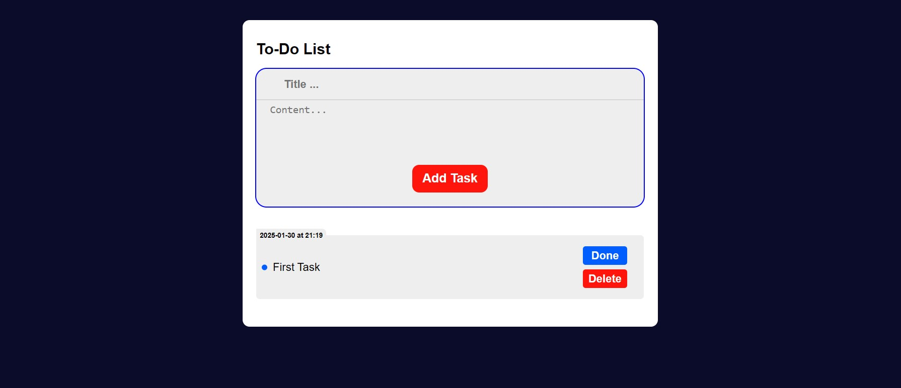
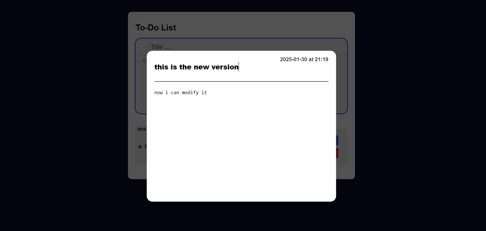

# To-Do-List-Application
Advanced to do List Application
### Most Point
- add Task and Store It in local Storage
- update the content and title of the Task [if pressed on task element]
- complate task and sort it in the last of list [if pressed on done button]
- delete task and remove it from local Storage [if pressed on delete button]

